# PST Julekalender 2021

NPST (Nord Polar Sikkerhets Tjeneste) er en julekalender som er laget av [PST](https://www.pst.no/) og avholdes for tredje året på rad. Man hadde også dette året gleden av å bruke det fantastiske systemet [DASS](https://dass.p26e.dev/) for å motta meldinger og levere flaggene man fant. Hver oppgave ble som regel lagt ut klokken 18:00 og man hadde også skjulte flagg. Helt nytt av året var at det også befant seg et skjult flagg i Forsvarets CTF-konkurranse [cybertalent](https://ctf.cybertalent.no/)

[Lokalvert](https://www.lokalvert.no/) er et veldig lite CTF-lag som stillte med deltagerne [marrekanin](https://github.com/MarreKanin) og [tronderhack](https://github.com/aigelonic). Begge veldig fornøyde med dette årets utgave av julekalenderen og var imponerte over alle de fantastiske oppgavene PST hadde klart å finne frem dette året.

Under finnes løsningsflagget til alle oppgavene og et lite innblikk i hvordan vi gikk frem for å løse oppgavene.

| Dag                              | Flagg                                               |
| -------------------------------- | --------------------------------------------------- |
| [Luke 1](#Luke-1)                | `PST{HelloDASS}`                                    |
| [Luke 2](#Luke-2)                | `PST{MANGE SNILLE BARN I VERDEN}`                   |
| [Luke 3](#Luke-3)                | `PST{JULENISSENERTEIT}`                             |
| [Luke 4](#Luke-4)                | `PST{DetBlirFortRot}`                               |
| [Luke 5](#Luke-5)                | `PST{5Q1_1nj€Ⓒt10n}`                                |
| [Luke 6](#Luke-6---Ukens-ansatt) | (hviledag)                                          |
| [Luke 7](#Luke-7)                | `pst{nootnoot}`                                     |
| [Luke 8](#Luke-8)                | `PST{R3m3mb3r_m3?_W3_h4d_SO_MUCH_FUN_t0g3th3r!_:D}` |
| [Luke 9](#Luke-9)                | `PST{JEGSNAKKERMEDDEGFRASTUE}`                      |
| [Luke 10](#Luke-10)              | `PST{c3ce11494e56a8897b6f80d1ca3dbe}`               |
| [Luke 11](#Luke-11)              | `PST{JuleLama}`                                     |
| [Luke 12](#Luke-12)              | `pst{berlinerkranser}`                              |
| [Luke 13](#Luke-13)              | (hviledag)                                          |
| [Luke 14](#Luke-14)              | `PST{RUNFORESTRUN}`                                 |
| [Luke 15](#Luke-15)              | `PST{HerVarDetIkkeMyeÅSeGitt...}`                   |
| [Luke 16](#Luke-16)              | `PST{H4KKIPL4PL4T4} `                               |
| [Luke 17](#Luke-17)              | `PST{SKYRIVAL}`                                     |
| [Luke 18](#Luke-18)              | `PST{GET_CLEAN_GO_GREEN!}`                          |
| [Luke 19](#Luke-19)              | `PST{Nissen_i_pipa}`                                |
| [Luke 20](#Luke-20)              | (hviledag)                                          |
| [Luke 21](#Luke-21)              | `PST{ReadingBetweenTheLetters}`                     |
| [Luke 22](#Luke-22)              | `pst{utpaaturaldrisur123}`                          |
| [Luke 23](#Luke-23)              | `PST{Maximilian} `                                  |
| [Luke 24](#Luke-24)              | `PST{1f2d444c083479aff98839fa6e48d00c}`             |
| [Egg 1](#Egg-1-under-Luke-10)    | `PST{EGG_StRpiITbqyEsBJM}`                          |
| [Egg 2](#Egg-2-under-Luke-12)    | `pst{erteluj}`                                      |
| [Egg 3](#Egg-3-under-Luke-14)    | `PST{Egg_RudolfErRoedPaaNesen}`                     |
| [Egg 4](#Egg-4-under-Luke-23)    | `PST{Egg_515620}`                                   |

## Luke 1

```
Velkommen !

Veldig hyggelig å ha deg ombord og fint å se at du har funnet veien inn til DASS. For at du skal finne deg mer til rette anbefaler jeg deg å sette ditt eget preg på systemet! Dette kan du gjøre ved å velge «Mal» fra startmenyen, mal din egen skrivebordsbakgrunn og velg Fil -> Sett som skrivebordsbakgrunn. Her er det bare kreativiteten som setter begrensninger, men i tilfelle du trenger litt starthjelp, legger jeg ved et eksempelbilde.

Spent på å følge deg videre, lykke til!

Hilsen HR

📎eksempel_bakgrunnsbilde.png
```

Fikk et "velkomsbilde" og kjørte den gjennom standard steg-tool-chain.
`zsteg -a filnavn.png` ga svaret umiddelbart.

`PST{HelloDASS}`

## Luke 2

```
Velkommen til teamet !

Vi går rett på sak. I fjor rakk ikke julenissen å dele ut pakker til alle som hadde gjort seg fortjent. For å komme til bunns i årsaken ble det satt ned et utvalg med mandat til å utnevne en kommisjon som skulle starte arbeidet med opprettelsen av en granskningskommité. Da granskningskommiteen kom med sin utredelse viste det seg at mulighetsrommet for å utøve slemme handlinger ble betraktelig redusert ved nedstenging og isolasjon. Det hadde rett og slett blitt for mange snille barn.

Da nedstenging og isolasjon delvis har vedvart, har det høy prioritet i år å finne en ny, mer optimal rute.

Julenissen fant i går en huskelapp som han tror kan være relevant, men han klarer ikke å finne ut av hva han skulle huske. Kunne du hjulpet han med det?

Mvh Mellomleder

📎huskelapp_til_2021.txt
```

En fil med et array av array på to og to tall - var mistenkelig lik koordinater: `[78.836714, 16.805659]`
Tok å kopierte første par ut og googlet og riktig nok var Google Maps på et bestemt sted første treff.

Kopierte array ut it et IntelliJ IDE som har autoformat på JSON.
Formatterte input, litt enkel manipulering og man kunne lett kopiere ut alle koordinatene slik at de ble på formen

```
78.836714, 16.805659
78.85211, 16.805659
78.862683, 16.805659
....
```

Brukte så litt tid på å finne et online tool for plotting av koordinater i kart og landet til slutt på [https://www.gpsvisualizer.com/](https://www.gpsvisualizer.com/).
Denne ga da løsningsordet etter å ha kopiert inn alle koordinatene.

Alternativ løsning:

```python=
import matplotlib.pyplot as plt
import matplotlib.image as mpimg
lister = [[78.836714, 16.805659],....[78.835014, 20.919251]]
fig, ax = plt.subplots()
def mapping_data(atlas_data):
    x, y = [], []
    for i in lister:
        if i:
            x.append(i[0])
            y.append(i[1])

    return x, y
y, x = mapping_data(lister)
ax.plot(x, y, linewidth=1, zorder=2, marker = '.', markersize=0.3)
ax.imshow(mpimg.imread('./map.png'), extent=(16.5057, 21.5450, 78,79), zorder=1)
plt.show()
```

Denne løsninga plotter kordinatene inn i `matplotlib` og resulterer en grafisk tegning. Her kunne man brukt mer tid på å gjøre budskapet mer tydelig, men man kan se hva løsningsordet er:


`PST{MANGE SNILLE BARN I VERDEN}`

## Luke 3

```
God fredag. Det Nordpolare Postkontor har oppdaget et julekort som er på vei til Antarktis. Etterretning viser at pingvinene i Antarktis ikke alltid har ren snø i skuffa. Det er derfor ønskelig at en alvebetjent gjennomfører en rutinemessig kontroll, og undersøker julekortets bakside og framside. Rapporter tilbake et eventuelt funn innpakket i pst{}.

📎 julekort_baksiden.jpg
📎 julekort_framsiden.jpg

Mvh Mellomleder
```

To bildefiler:

og
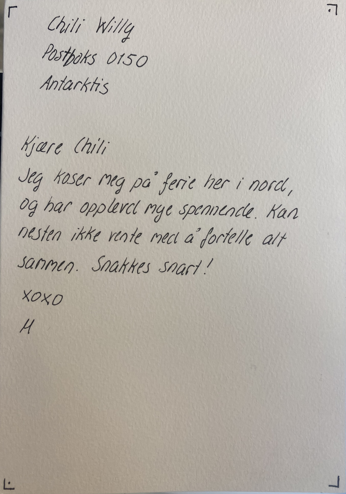

Første inntrykk var å kjøre `strings`, `exiftool` og andre steg-verktøy, men så raskt at det var lite å hente umiddelbart.

Stusset litt på at de var såpass store/høy oppløsning at man burde zoome og inspisere litt.
Da så man relativt raskt at det er en del tegn som er tegnet på og å søke på f.eks. "cipher squares and boxes" gir `PigPen-cipher`.

Finnes hjelpeverktøy online for å enklere få cipher over på tekst-form, eksempelvis: [](https://planetcalc.com/7842/)

Tar man forsiden først (med å starte øverst til venstre og kjører på med leseretning):
`UAEUJENEVVANEPTR`
Mens baksiden (leser clock-wise): `IPLA`

Som viser seg å være _helt_ feil.
Man må _rotere_ bildet 180 grader for så å kjøre PigPen-dekoding for å få løsningsordet.

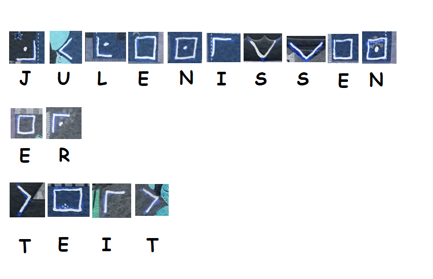

`PST{JULENISSENERTEIT}`

## Luke 4

```
HMS-ansvarlig var innom verkstedet i går og var helt forskrekket over rotet vi har etterlatt oss der. Jeg er litt opptatt med møter i dag, kan du ta deg tid til å rydde litt? Oversikt over hva vi har på verkstedet ligger vedlagt.

Mvh Mellomleder

📎verksted_npst.txt
```

Fikk en CSV-fil med flere kolonner `Indeks;Hylleplass;Utstyr;Id`, som skal sorteres (essensielt oppgaveteksten).

Første forsøk er å sortere CSV-en direkte i excel, uten at det ga noen hint (som forventet).

Observerer at mange av hylleplass verdiene ser ut som hex-verdier og konverterer derfor alle verdier som kan konverteres til ASCII og ser da at man får ut P, S, T, og {, } blant verdiene.
Må da kun finne rett rekkefølge på radene for å få teksten.

```python=
import csv
with open('verksted_npst.txt', 'r', encoding='utf8') as file:
    file_contents = csv.reader(file, delimiter=';')
    sortedlist = sorted(file_contents, key=lambda column: column[2])
    solution = ''
    for row in sortedlist:
        char = row[1].strip()
        if char == 'Hylleplass':
            continue
        if len(char) == 2:
            try:
                solution = solution + bytearray.fromhex(char).decode()
            except ValueError:
                continue
    print(solution)
```

Prøving of feiling ga til slutt at man måtte sortere på kolonne 2 (hylleplass), som ga
`PS|T:{lD:etBlirFortRot}` - hvor man ikke har gjort noe videre vasking. Filtrerer man ut hexkarakterer annet enn lengde på 2, blir løsningen:

`PST{DetBlirFortRot}`

## Luke 5

```
Har du mulighet til å se om Varelager v1 funker som det skal og at det ikke skjuler seg noen feil i systemet?

Varelageret finner du her, og bruk programmeringsgrensesnittnøkkel v1_pgmsqxmddz.
```

Man får utlevert url til NPSTs [varelager](https://varelager.p26e.dev/)

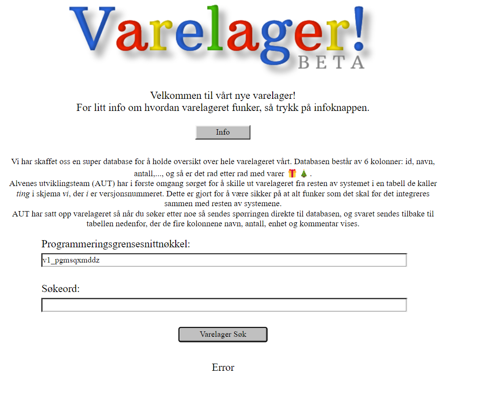

Her får man muligheten til å søke i databasene til alvene. Sjekker man ut kildekoden til siden finner man `bundle.js` som gir hint om hjelp som søkeord.

```
"hjelp" === e.get("search-term") || "Hjelp" === e.get("search-term")
```

Det kommer så en alert med informasjon:

```
https://youtu.be/ciNHn38EyRc
Men bruk "null" for å fylle opp til riktig antall kolonner i stedet for et tilfeldig tall som de gjør.
```

Youtubevideoen referer til sqlinjection som gjør at man mest sannsynligvis har med en sqlinjection å gjøre i oppgaven.

Her kan man bruke sqlmap eller andre bruteforceverktøy men løsningen her er veldig simpel, da man i utgangspunktet bare trenger å escape spørringa med en simpel `'--`

Da får man alle varene listet i json-format og man kan søke etter PST og finne:

```json
{
  "id": "13b97062-dd26-41dc-bda0-58e4be6d1deb",
  "navn": "Ukjent vare",
  "antall": 1,
  "enhet": "stk",
  "kommentar": "🚩",
  "flagg": "PST{5Q1_1nj€Ⓒt10n}"
}
```

Løsningen blir da:

`PST{5Q1_1nj€Ⓒt10n}`

## Luke 6 - Ukens ansatt!!

```
Vi vil takke dere alle for strålende innsats i første uke som alvebetjenter!

Og samtidig annonsere at Peter er ukens ansatt! Gratulerer!

Takk for godt samarbeid, vi ser frem til fortsettelsen.
```

## Luke 7

Her får vi presantert en kryptert melding som er fanget opp og man ønsker å få dekodet meldingen.

```
E-alvene mener det er en umulig oppgave siden de ikke klarer det, men jeg håper at du kanskje har litt nyansattflaks.

Her er meldingen:
Y2MPyYU4kblEXrEfExry4AIRAjqdke+JyQQN50Uj5GuCu5rE66lEzQXB5bE VOlNGRoU06Ny4vh/gzSPFV0mHUrxaaAVt1BwN1WN1HFT7baIejtR5KyG6 JK8yC70CpuPZV610coCiWzdFICcgEtAdQaesScLrg495kxofzG3EGvA=
```

Ved første øyekast så ser teksten ut til å være base64, men antallet stemmer ikke helt og tekstene er delt opp i 3 deler med et mellomrom. Sammen dannes det gyldig base64, men ingenting som skiller seg ut

Uten hint var denne meldingen vanskelig å starte å finne tråden på. Det ble prøvd både vigenere, xor og rsa i forskjellige variasjoner, alle uten hell. Etter en stund kom det et hint på løsning:

```
en Alvebetjent gjorde meg oppmerksom på at det kan ha foregått En nøkkelutveksling tidligere i desember, kanSkje det kan hjelpe i oppklaringen?
```

Den eneste utvekslingen av informasjon man kan tenke tilbake på er når den mystiske M sendte julekort til Chili Willy. Der var løsningen på oppgaven `julenissenerteit` som vi tar med oss videre, men vi vet ikke hva vi skal bruke det til enda.

For den oppmerksomme så er det noe "rart" med bokstavene i forrige melding. Tar man kun de store bokstavene får man `AES` - et sterkt hint om hvilken kryptering det er snakk om.

Noe senere kommer nok et hint til oppgaven:

```
en Alvebetjent gjorde meg oppmerksom på at det kan ha foregått En nøkkelutveksling tidligere i desember, kanSkje det kan hjelpe i oppklaringen?
```

Etter mye fram og tilbake med verktøy både online, cybershef og i python setter vi opp følgende innstilling til å knekke koden:

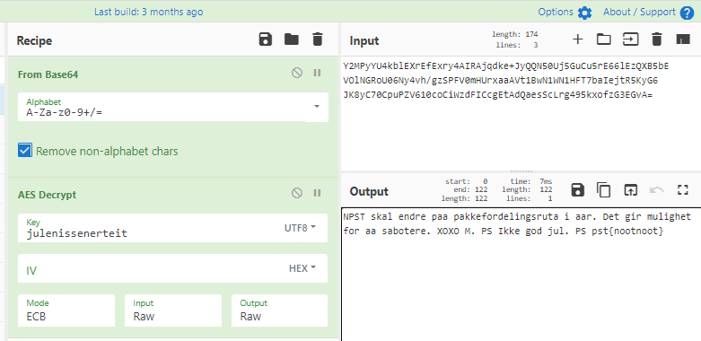

```
NPST skal endre paa pakkefordelingsruta i aar. Det gir mulighet for aa sabotere. XOXO M. PS Ikke god jul. PS pst{nootnoot}
```

Flagget blir da `pst{nootnoot}`

Alternativ løsning i python:

```python=
from Crypto.Cipher import AES
import binascii
from itertools import permutations
key = b'julenissenerteit'
decipher = AES.new(key, AES.MODE_ECB)
msg_dec = decipher.decrypt(binascii.unhexlify(b"63630fc9853891b9445eb11f131af2e00211023a9d91ef89c9040de74523e46b82bb9ac4eba944cd05c1e5b1153a5346468534e8dcb8be1fe0cd23c557498752bc5a68056dd41c0dd563751c54fb6da21e8ed4792b21ba24af320bbd02a6e3d957ad747280a25b374520272012d01d41a7ac49c2eb838f79931a1fcc6dc41af0"))
data = (binascii.hexlify(msg_dec).decode())
print(bytearray.fromhex(data).decode())
```

## Luke 8

```
En av alvebetjentene fant et løst frimerke i postmottaket. Initielle undersøkelser viser at det ikke kan ha sittet på julekortet som kom den 3. desember, da fiberne som sitter igjen i limet ikke er av samme type som julekortet. Fiberne kan minne om setetrekket fra en reinsdyrslede klasse 8.

Motivet på frimerket er av en slik karakter at det må undersøkes nærmere. Kan du ta en titt?
```


Ser man visuelt på Red0-planet så finner man:

Dette finner man i Red0, Green0 og Blue0:
  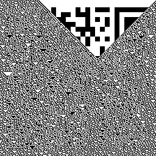

Trekker man ut dataene fra cybershef med funksjonen "Exctract LSB" og velger den Green0 så ser man at headeren av dette planet begynner på .SLEDE8 som indikerer at vi har funnet en binærfil for [slede8](https://slede8.p26e.dev/)

Vi kan lagre denne fra cybershef og ta den inn i hexedit og slette paddinga av fila vi ikke trenger.

Velger man samme funksjon men skifter over til Blue0 og legger på en påfølgende XOR med `ff` som hex-nøkkel så får man fram en fil som starter med "Frimerke" som er representert i bildet ved Red0. Vi lagrer denne fila fra cybershef også.

Vi har nå 3 filer:

| Fil               | Forklaring                                                |
| ----------------- | --------------------------------------------------------- |
| `Blue0.data`      | Er kun random data så langt                               |
| `Blue0XoRed.data` | Er XoRed fra Blue.data og inneholder "Frimerke" i starten |
| `Green0.data`     | Er .SLEDE8-binærfila vår                                  |

Utifra hintet i Red0 så skal vi kjøre binærfila for SLEDE8 og ta inn føde i form av hexdata utifra `Blue0XoRed.data`. For å kjøre SLEDE8 så har [Unblvr](https://twitter.com/unblvr1) skrevet er [emulator](https://github.com/myrdyr/ctf-writeups/blob/master/npst20/runner.py) som gjør det mulig for oss å kjøre. Denne står å kjører en stund og spytter ut data som er relativt lik føden vi ga programmet.

Nå sier instruksjonene i Red0 at vi skal XoRe resultatet av slede kjøringa med Blue0-laget. Dette gjøres best i Cybershef - men først må vi encode outputen av Slede8 til hex. Dette skal være nøkkelen til XOR-operasjonen.

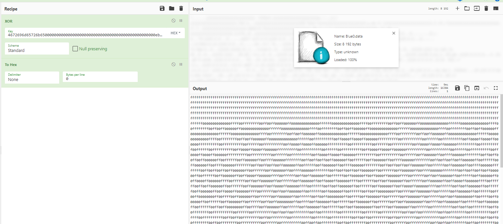

Resultatet vi får på den andre siden er bare 0'er og f'er. Enten så er dette binær kode eller så er det ett eller annet som danner noe grafisk. Etter justering av bredden av teksten i cybershef ser vi fort at dette danner firkanter i en QR-kode. Vi finner ut at linjeskillet for å tegne koden riktig er på 192-karakterer. Vi skrever et lite script:

```python=
stringer = '...data...'
n = 192
data = ([stringer[i:i+n] for i in range(0, len(stringer), n)])
for x in data:
    print(x)
```

I strengen for data så bytter vi også om på tegnene slik at 0 blir █ og f blir ' ' (mellomrom) bare for å differiansiere opp bedre.

Vi ender til slutt opp med 3 x QR-kode som er veldig strukket. Vi redigerer litt i paint og trykker den sammen til den blir scanbar av app som vi bruker på telefonen. Dette danner da dette fine bildet:


Flagget er `PST{R3m3mb3r_m3?_W3_h4d_SO_MUCH_FUN_t0g3th3r!_:D}`

## Luke 9

```
Hei,

Fikk tilsendt denne filen fra IT-avdelingen i går, de har TAPpet filen ut av nettverket. Har du mulighet til å se på den? Mulig den gir oss litt mer informasjon angående lekkasjen vi hadde ut til SPST. Husk, dette forblir mellom oss, i tilfelle det viser seg å være en av våre egne.

Mvh Mellomleder

📎npst_02_12_21_18_00.pcap
```

For å sjekke innholdet i denne fila har vi verktøy som wireshark eller NetworkMiner, men i dette tilfellet hjelper det ikke oss så mye, da all kommunikasjon består av gruppevise tall:

`44 42 34 21 25 15 22 43 33 11 13 13 15 42 32 15 14 14 15 22 21 42 11`

Hintet i oppgaven referer til [TAP-code](https://en.wikipedia.org/wiki/Tap_code) som er en kombinasjon av tallene 1-5 og morse. Man har i utgangspunktet en oversettelsesmatrise som gjør at man konverterer disse tallene til tekst.

Vi gjorde dette med et python-script:

```python=
# -*- coding: utf-8 -*-
import json
def returnCipher(cipherlist):
    datastr = ''
    for y in cipherlist:
        try:
            if int(y):
                pass
        except:
            datastr += ' '
        try:
            if int(y) in TAP:
                datastr += TAP[int(y)]
            if int(y) not in TAP and y != '':
                datastr += y
        except:
            pass
    return datastr
TAP = {
    11: 'A', 12: 'D', 13: 'K', 14: 'D', 15: 'E',
    21: 'F', 22: 'G', 23: 'H', 24: 'I', 25: 'J',
    31: 'L', 32: 'M', 33: 'N', 34: 'O', 35: 'P',
    41: 'Q', 42: 'R', 43: 'S', 44: 'T', 45: 'U',
    51: 'V', 52: 'W', 53: 'X', 54: 'Y', 55: 'Z'
}
with open('data.json', encoding='utf-8') as lagerfile:
    data = json.loads(lagerfile.read())
    for x in data:
        try:
            data = (x['_source']['layers']['data']['data.data'].replace(':', ''))
            srcip = x['_source']['layers']['ip']['ip.src']
            destip = x['_source']['layers']['ip']['ip.dst']

            cipher = (bytes.fromhex(data).decode('utf-8'))
            cipherlist = cipher.split(' ')
            line = (srcip+'\t'+ destip+'\t'+ returnCipher(cipherlist)+ '\n')# + '\t'+ ' '.join([x for x in cipherlist])+'\n') #For debugging
            if 'SNAKKER' in line:
                print(line, returnCipher(srcip.split('.')))
            # FOR OUTPUTING TO FILE
            # with open('outfile.data', 'a') as outfile:
            #     outfile.write(line)
        except Exception as e:
            print(e)
```

Vi hadde på forhånd sjekka at ip `43.35.43.44` var unik da den hadde kun 1 beskjed, som sa `DET ER MOTTATT`. Ved å se på andre beskjeder i fila, så var det mange av disse, men meldingen før denne unike utvekslingen hadde noe intersant:

`PST KROLLPARANTES F APOSTROF JEG SNAKKER MED DEG FRA KROLLPARANTES KROLLPARANTES SLUTT APOSTROF KROLLPARANTES SLUTT `

Dette kan oversettes til `PST{F"JEG SNAKKER MED DEG FRA{SOURCEIP}"}` Her er det ganske sikkert at det er snakk om en python [f-string](https://realpython.com/python-f-strings/#f-strings-a-new-and-improved-way-to-format-strings-in-python) så her må vi formatere koden vår litt.

Man skal også formatere IP-adressen (43.44.45.15) til TAP-kode her. 43 44 45 15 oversettes til `STUE` Den ferdige strengen til flagget blir da:

`PST{JEGSNAKKERMEDDEGFRASTUE}`

## Luke 10

Oppgaven var igjen tilbake til varelageret.
Oppgaveteksten er som følger:

```
Alvebetjent Eline har oppgradert varelageret til v2 etter at det ble oppdaget litt muffins i versjon 1. Som en del av videreutviklingen har hun slått sammen v2 med resten av bruker-systemene til NPST, slik at det ikke trengs mange ulike databaser oppe i skyene.

Har du mulighet til å sjekke at alt funker som det skal etter Elines oppgradering?

Varelageret finner du som vanlig her, og bruk programmeringsgrensesnittnøkkel v2_vr7n0p1tf7.

Mvh Mellomleder
```

Siden det var SQL-injection sist vi bare på denne siden, så var det nærliggende å tro at vi skulle gjøre noe lignende igjen.
I oppgaveteksten hinter de om "bruker-systemer", som tilsier at det kanskje er flere tabeller.
En `UNION` SQL gir oss mulighet til å hente ut data fra andre tabeller, så lenge vi henter like mange kolonner. Man kan "padde" med `null` på kolonner som man ikke vet navnet på.
Så da ble de første forsøkene på formen
`' union select null,null,null,null,null,null from v2.SOME_TABLE ;--`
Med litt prøving og feiling så fant vi ut at `SOME_TABLE=brukere`, og fant veldig raskt at følgende spørring virket
`' union select id,passord,null,null,null,null from v2.brukere ;--`
Problemet nå var at vi fikk et resultatsett med 1800 rader/brukere, og hvert eneste passord var på formen `PST{SOME_HEX_VALUE}`.
Etter litt mer graving, så fant vi en kolonne til (kunne ikke være i "tredje plass", da denne er "antall" i lager-spørringen):
`' union select id,passord,null,navn,null,null from v2.brukere ;--`
som ga oss også navnene på alle brukere.
Tilbake til oppgaveteksten så nevnes det eksplisitt et navn som man finner igjen i data-settet, Eline. Passordet til denne personen er flagget.

## Luke 11

```
Beklager for å forstyrre deg på en lørdag, men det haster.

En av terminalene på julenissens kontor har utvist rar oppførsel de siste dagene. AlveCERT har sikret data fra hjemmeområdet, finner du noe muffens?

Mvh Mellomleder

📎sikring.tar.gz
```

Filen man får viser seg å være litt "kryptisk" i den forstand at man kan pakke det ut og etterpå får man en fil, uten fil-endelse. Det går an å åpne filen i 7Zip og man ser en fil "guardians.jpg" i den, men man får bare feilmeldinger hvis man prøver å pakke den ut.

Kjører standard approach med `strings`, `binwalk`, `file` o.l., uten at det ga noe umiddelbart.
`file` viser

```
sikring_alveCERT: Linux jffs2 filesystem data big endian
```

og litt googling på "jjfs2" så viser det seg at dette er en "Flash-image". Å åpne den eller mounte den er ikke rett frem. Fleste forsøk gir bare at mounting er korrupt.

Til slutt kom vi over [https://github.com/sviehb/jefferson](https://github.com/sviehb/jefferson) som virket lovende. Første installering av verktøyet ga bare feil, men med å gå på en eldre versjon (1.8) av dependency som ligger i requirements.txt, så funket det.
Kjørte toolet og den greide å pakke ut imaget.
Da fikk vi en del filer (blant annet en flag.txt, som klart og tydelig sa at dette ain't it), med fem dyrebilder. Det viste seg også å være en skjult fil `.sys` som også kunne åpnes i 7Zip og i den lå `guardians.jpg`.
Ser man på egenskapene (exiftool, evt strings også), så kommer man over tekststrengen `CFG{WhyrYnzn}` som ser mistenkelig ut som et flagg.
Litt prøving og feiling med den viser seg videre at kan kjøres gjennom en ROT13 som da ga flagget.

`PST{JuleLama}`

## Luke 12

```
God søndag! Det er fanget opp tO krypterte meldinger som ble sendt under lunsjgrøTen i dag. Det vekker mistanke, siden alle alvebetjenter elsker grøt og aldri vil gå gliPp av en lunsjgrøt. Se de krypterte meldingene nederst i mailen. En dyktig alvebetjent har allerede funnet noen biter av klarteksten til melding 1:

"- - - k r o e l l - - - - - - - - - - - - - - - - - - - - - - - k r o e l l - - - - - - - -"

og noen biter av klarteksten til melding 2:

"- - - - - - - - - - - - - - - - p e n g w y n - - a - - o l - n - - - - - - - - - - - - - -"

Kan du se om du klarer å finne resten av klarteksten til begge meldingene? Legger også ved en tabell over ascii-verdier, kanskje du får bruk for den.

Melding 1:

00010101 00010100 00010011 00000000 00011101 00000011 00001010 00000010 00011100 00000011 00010101 00011001 00010111 00000001 00010001 00001001 00011111 00010010 00000100 00000000 00001001 00000111 00011010 00000000 00000001 00001110 00000000 00010101 00001011 00011111 00010000 00011000 00000000 00000000 00000000 00000000 00000000 00000000 00000000 00000000 00000000 00000000 00000000 00000000 00000000 00000000

Melding 2:

00010110 00001100 00000110 00000111 00001000 00000101 00001101 00001011 00000011 00011000 00011110 00001110 00010110 00001001 00010111 00001101 00011100 00010101 00001111 00010101 00010010 00010111 00011010 00001010 00011110 00000100 00000110 00000111 00001010 00000000 00010000 00000100 00011000 00011001 00000110 00001011 00000010 00001001 00000010 00001000 00011111 00001010 00011100 00010011 00000000 00011101

📎 ascii.pdf
```

Hint i teksten, igjen se etter store bokstaver, gir OTP - eller One-Time Pad, som er et XOR-siffer.
Googlet litt rund og fant ut at en vanlig måte å løse disse på er en metode som heter `crib dragging`. Så letet deretter på dette som søkeord og kom da over online-verktøyet
[https://toolbox.lotusfa.com/crib_drag/](https://toolbox.lotusfa.com/crib_drag/).

For å bruke denne så tok vi å brukte CyberChef til å konvertere binær-meldingene til hex-strings.

Så var det bare å gjette ord, frem til man fant hele teksten - noe som var en relativ lett øvelse.

Løsningen ble da:

`pst{berlinerkranser}`

## Luke 13

```
Kjære alle sammen,

Takk for enda en uke med strålende prestasjoner!

Denne uken har vi gleden av å berømme Carixo som ukens ansatt!

Vi gratulerer, og takker for den gode jobben.

Ha en fin dag, alle betjenter. :)
```

## Luke 14

```
Fire av Julenissens favorittreinsdyr ble sluppet løs fra basen på Svalbard i går. Heldigvis er det sporing på reinsdyrene, så en av alvene i NPST har funnet en datamaskin og lastet ned sporingsdataen. Han klarer dessverre ikke å finne ut hvordan man får tak i GPS-filene.

Kan du hjelpe han?

Nb: Hvis du skulle finne noe mistenkelig i dataen, så rapporter tilbake med hva du fant, omkranset av PST{ og }.

Mvh Mellomleder

📎 sporing.zip
```

Her får vi utdelt et bilde `Rudolf.png`, `lost_key.txt` og `gps.7z`. gps.7z er passordbeskyttet men man ser at den inneholder `Reindeer_tracker.kml`. Rudolf.png blir tatt inn i stegsolve og man finner fort at det skjuler seg en skult tekst i Red2-planet: floduR123


Vi regner med at dette er passordet for gps.7z som gjør at vi får ut filen Reindeer_tracker.kml og det stemmer på en prikk. Tracker-fila inneholder 4 gps-spor av Rudolf, Prancer, Comet, Cupid og Slede.

Filen kan vi laste opp til https://www.gpsvisualizer.com for å se på de ulike gps-sporene som er oppretta:

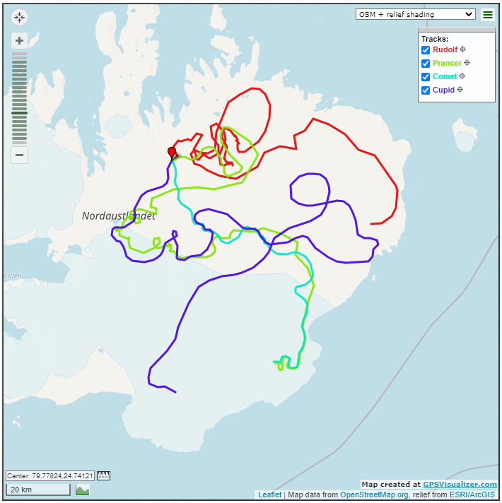

Å finne neste steg var noe utfordrende da data kan gjemmes mange steder her. Var det en sammenstilling av alle sporene som skulle gjøres? Hadde høydedataene mot lang/long-posisjonene noe å si?

Til syvende å sist så var løsningen ganske **teit**, da man ser at de ulike sporene har noe variasjoner og artifakter. Det ser nesten ut som noen raker eller hakk i sporene:


Ved å sammenligne flere av disse abnormalitetene så kom man over på tanken om at dette måtte være en representasjon av morse-tegn. Vi går da over alle sporene å begynner i samme rekkefølge som filen dikterer:

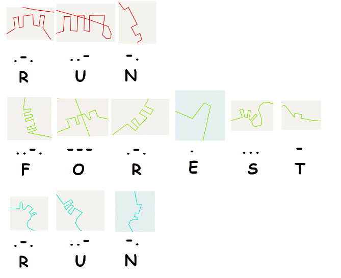

`PST{RUNFORESTRUN}`

## Luke 15

```
Etter gårsdagens reinsdyrflukt bestemmer alvebetjent M. Nist seg for å sjekke kameraloggen. Dessverre ser det ut som om det bare eR blått og grØnt støy Der... Klarer du å finne ut noe mer fra opptaket?

Mvh Mellomleder

📎 opptak.gif
```

Innholdet av opptak.gif virker tilsynelatende som bare støy:

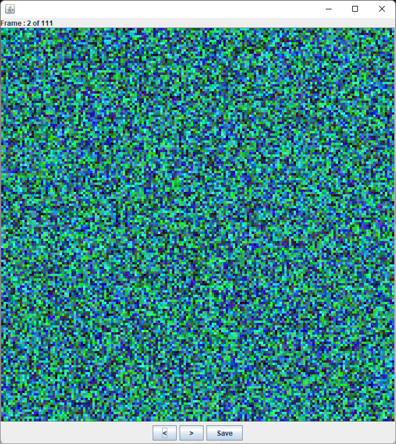

I oppgaven så har de uthevet bokstavene RØD som henviser til det røde planet på bildene som er satt sammen til en gif. Først må vi eksportere alle framsene av .gif-en til enkeltstående bilder.

`convert opptak.gif target.png`

Nå var var det tid for å konvertere enkeltstående bilder til å vise deres Rød-kanal, denne kommandoen kjøres for 1 bilde:

`convert target-0.png -channel R -separate target_out_0.png`

Da kommer dette til syne i det første bildet:
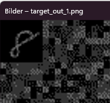

For oss som er redde for bash-script så ble det laget dette python-scriptet for å konvertere alle filene (111 stk):

```python=
import os
for x in range(0, 110):
    os.system('convert ./target-'+str(x)+'.png -channel R -separate ./target_out_'+str(x)+'.png')
```

Nå fikk vi ut alle framesene men det er fortsatt ikke lett å få lest av de ulike tallene og mellomrommene.

Nå kan vi sette sammen alle bildene til en gif igjen med dette online-verktøyet: https://ezgif.com/maker

Når dette er gjort så kan vi også croppe størrelsen på gif-animasjonen slik at vi får bare sett på tallene som gjemmer seg oppe til venstre hjørne:


Nå kan vi konvertere ut disse til bilder igjen. Samme nettsted har også splitfunksjon som gir en pen visning av alle enkeltbilder etter split:

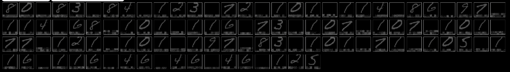

Det er kanskje noe vanskelig å se her men dette resulterer i tallene:

`80 83 84 123 72 101 114 86 97 114 68 101 116 73 101 107 101 77 121 101 197 83 101 71 105 116 116 46 46 46 125`

Etter en kjapp glans over disse tallene så ser vi fort at dette er desimalrepresentasjonen av ASCII-tekst. Da kan vi enkelt ta disse tallene inn i cybershef og konvertere de:

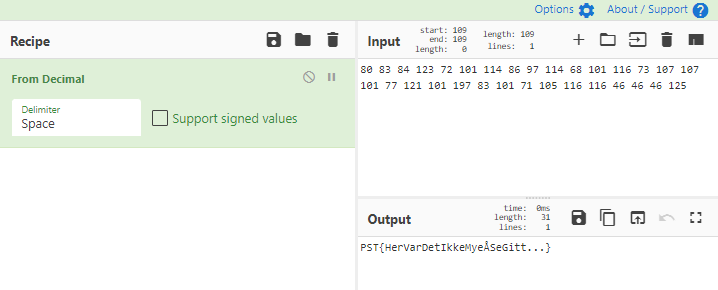

Da får vi flagget: `PST{HerVarDetIkkeMyeÅSeGitt...}`

## Luke 16

```
Alvene på verkstedet klager over dårlig kvalitet på noen av julesangene som spilles over høyttalerne. Særlig denne sangen, "Rudolph, the Red-Nosed Reindeer", har mottatt mange klager. Kan du se om du finner ut hva som er galt?

📎 rudolf.wav

Det spilles et bredt spekter av julesanger på verkstedet, men denne sangen er egentlig en favoritt blant alvene. Da er det jo ekstra synd at lydkvaliteten er dårlig.

Mellomleder
```

En lydfil kan inneholde flere skjulte koder på mange nivå. Det første er å høre på lydfilen som man har fått tildelt. Det er slik oppgaveteksten skriver, at det er noe skurr på lydsporet noe inn i sangen.

Vi kan åpne lydfilen i Sonic Visualizer og se at det er tydlige endringer i lydkurvene:


Sonic Visualizer har også en funksjon får å legge til spektogram for lydfilen man har åpnet. Når vi kjører denne funksjonen så ser vi at flagget vårt kommer til syne:


`PST{H4KKIPL4PL4T4}`

## Luke 17

```
Hei,

nå Er det jo baRe en uke igjen til jul så vi må begynne å få på plass den nye pakkefordelingSruta. avdelingen for optimalisering og ruteplanlegging har jobbet hardt med å finne en trasé, og ga meg i går en Cd Hvor den foreløpige ruten er lagrEt. de fortalte meg at de hadde en baktanke med trasén, men ville ikke fortelle meg høyt hva dette var (i frykt for avlytting), så dette skulle komme frem fra fiLen. jeG sliteR med å tolke hvA de har tenkt. kunne du hjulPet meg?

mvH mellomleder

📎trasé.txt
```

Dette var kanskje den vanskeligste oppgaven å løse. Denne ga oss oversikt over 11 forskjellige koordinater fra et kart. Det ble spekulert tidlig i om at land-navnene eller by-navnene skulle bety noe spesielt her.

Det gikk en dag og julekaleluke 17 hadde da blitt løst av kun 1 alvebetjent - denne var vanskelig. Mest pga at det var ingen tydelige angrepsvektorer.

Ser man på de store bokstavene i oppgaveteksten så tyder de [HERSCHELGRAPH](https://en.wikipedia.org/wiki/Herschel_graph) som vi har nå i ettertid notert oss til å ikke være noe annet enn en decoy eller red herring.

Etter en dag kom det et hint til hvordan man skulle løse oppgaven:

```
Oppdatering angående gårsdagens Mail. En alvebetjent har funnet alle koordinatene på kartet og hentet ut de tilhørende byene. Kan dette være til hjelp?

[-11.725769, -61.778000] = Rolim de moura
[20.145221,-75.215909] = Guantanamo
[52.300000,76.95000] = Pavlodar
[23.101397,88.393575] = Ektapur
[-34.417148,19.248128]} = Hermanus
[-15.4825, 128.122778] = Wyndham
[78.216667,15.633333] = Longerbyen
[5.041066,7.919476] = Uyo
[45.424722,-75.695000] = Ottawa
[21.150000,79.083333] = Nagpu
{[17.083333,-96.750000] = Oaxaca

Mellomleder
```

Dette sier i utgangspuntet at hver forbokstav i alle bynavnene skal brukes - men til hva?

Her stod vi fast veldig lenge - men vi var innom [TSP](https://en.wikipedia.org/wiki/Travelling_salesman_problem) i ulike variasjoner, metoder for å generere Herschel grafer og mye mye mer. Vi stod faktisk helt fast på denne oppgaven men vi var så heldige å få gode hint fra NPST sin [uoffesielle discorkanal](https://discord.gg/34pCREqH).

Vi ser også at vi har krøllparanteser som wrapper 2 bynavn. Men rekkefølgen er helt gal. Vi har heller ikke bokstaver som kan danne PST her, så vi må nok også gjøre noe med dataene vi har. Det var også en tanke at krøllparantesene var start og stopp på hele bokstavrekka, men da får man ikke wrappet inn PST.

Vi har bokstavrekkefølgen `RGPEH}WLUON{O`. Etter flere hint fra discord, så skal man da gjøre en operasjon på disse, men det er nesten umulig å finne ut hvilken uten å prøve en hel masse ting. Vi landet til slutt på en ROT4-operasjon som inneholder bokstavene PST: `VKTIL}APYSR{S`

Når vi roterer på karakterene vi vet så får vi: `PST{SVKIAYRL}`

Nå ser vi at vi har en bokstavrekke på `SVKIAYRL` som ikke gir noen mening akkurat nå. S'en og L'en har fiksert plassering. Her kan vi bruke verktøy for å finne [anagram online](https://ingesanagram.com/) eller skrive et script for å enumerere alle mulige kombinasjoner:

```python=
import itertools
letters =  ['K', 'I', 'V', 'A', 'Y', 'R']
first = 'S'
last = 'L'
datalist = itertools.permutations(letters,r=6)
counter = 0
for x in datalist:
    stringer = first
    for g in x:
        stringer += g
    stringer += last
    print('PST{'+stringer+'}')
    counter += 1
```

Denne lista er på 720 stk. Her finner vi flere kandidater blant annet `PST{SYKAVIRL}` og andre gobiter. Men sluttordet er `PST{SKYRIVAL}`

## Luke 18

```
Hei,

Alvdelingen for nettverksoperasjoner har utført en hemmelig nettverksoperasjon mot SPST. De har snublet over et "git repository", men de synes det er noe merksnodig med det. Alv en eller annen grunn så mener Alvdelingen for tekniske undersøkelser at det kan ha noe med "grønne firkanter" å gjøre, hva nå enn det betyr.

Kan du sjekke det ut?

📎groenne-firkanter.zip

Om du trenger hjelp så kunne du kanskje spurt alvdelingen for åpne kilder - de tar sikkert en titt på Github profilen til personen som "comitter" i repoet, kanskje det ligger et hint der.

Mvh

Mellomleder
```

Her får vi utdelt en .git-repo som ikke inneholder noen vireklige data. Dete eneste mystiske her er at det er veldig mange commits som strekker seg over mange dager, også fram i tid. Man finner ut at repoen tilhører brukeren [underleder](https://github.com/underleder) som på github har dette som eneste informasjon:

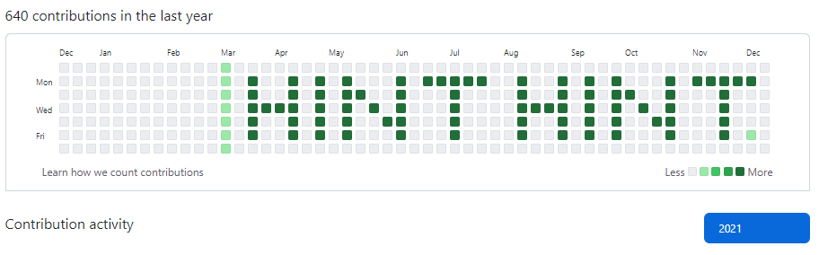

Dette sier oss at vi bør ta en titt på rekkefølga til alle commitene som har blitt gjort i repoet vi har mottatt i zip og prøve å gruppere på samme format slik som gjøres i github.

Etter en del frem og tilbake for å få formateringa på printing av grupperingen, stablet man dette pythonscriptet på plass:

```python=
# -*- coding: utf-8 -*-
from datetime import datetime

dates = []
datearray = []
with open('./groenne-firkanter/.git/logs/refs/heads/master') as inputfile:
    for line in inputfile:
        line = line.replace('\n', '')
        line = line.split()
        datestamp = int(line[4])
        date = (datetime.utcfromtimestamp(datestamp).strftime('%Y-%m-%d'))
        dateformat = datetime.strptime(date, '%Y-%m-%d' )
        year = dateformat.year

        if date not in dates:
            onedatearray = [year,dateformat.isocalendar()[1], dateformat.weekday()]
            if onedatearray not in datearray:
                datearray.append(onedatearray)
            print(dateformat.isocalendar()[1])
            print(dateformat.weekday())
            dates.append(date)
sortedlist = sorted(datearray, key=lambda column: (column[0], column[1]))
for year in range(2020, 2024):
    for day in range(0, 7):
        for week in range(0, 52):
            if [year, week, day] in sortedlist:
                print('██', end='')
            else:
                print('  ', end='')
        print('\n')
```

Dette resulterer i flagget:


`PST{GET_CLEAN_GO_GREEN!}`

## Luke 19

```
Hei !

Nissen forsøker å være mer produktiv i år, og unngå å gå ned i feil pipe. For å sørge for spe-serialisert levering har alvene ordnet en helt ny leveransemetode for denne pakkeleveringen.

Nå handler det bare om å finne riktig pipe! Og hva var det han ønsket seg igjen...?

📎Chimney_Chopper.ps1

📎Chimney_Client.ps1
```

Her får vi utdelt 2 filer som ser ut til å være en servertjeneste i powershell-script og en klienttjeneste også i powershell-script. Det utveksles data via `System.IO.Pipes.NamedPipeClientStream` og `System.IO.Pipes.NamedPipeServerStream`. Etter en del analyser ser man at dataene som utveksles fra klient til server er en input som skal dekode en kryptert tekst. Etter litt mer analyse så ser man at dette er pid-verdien til programmet som sendes. Klientprogrammet printer også pid-nummeret når programmet starter som hinter til at vi her er på riktig sport. Vi bruker parametrene fra serverfilen og enumererer PID-med en god gammeldags for-loop:

```powershell=
$ErrorActionPreference = "SilentlyContinue"
$Encrypted_Flag = "76492d1116743f0423413b16050a5345MgB8AGUAbwBRAEwAWQB1ADIARQB5AEEAZgB2AHIAWAB4ADQAdgA5AHIAQwBZAEEAPQA9AHwANQAxAGUAZQAxAGUAMABhADUAOAAwADMAZgBlADkAZQA3ADMANQA4AGIAZAAzADAAYQA5ADYANQA4ADMAZABhAGEAOABmADgANQAxADAANAAwADMAMwA5ADkAYQA4AGIAMABkAGQAMgA0ADIANgAyAGEAZgBkADUAZgBjADAAZQBhADAAMAAxADkAZQA0ADMAMwBkADIAMQA5ADIAMgA0ADcAMgA2AGUANABlAGQAYQBkAGYAYQA3ADQANAA5ADgA"
For($i=10000; $i -lt 50000; $i++) {
    $Payload = [Convert]::ToBase64String([System.Text.Encoding]::UTF8.GetBytes($i))
    $addressLookup = (Get-FileHash -InputStream ([IO.MemoryStream]::new([byte[]][char[]]$Loadstring)) -Algorithm SHA384).hash
    $Loadstring = [Text.Encoding]::Utf8.GetString([Convert]::FromBase64String($Payload))
    $key = [byte[]]($addressLookup[0..15] -join "").ToCharArray()
    $ss = ConvertTo-SecureString -String $Encrypted_Flag -Key $key
    $way = [System.Runtime.InteropServices.Marshal]::SecureStringToGlobalAllocUnicode($ss)
    $decoded = [System.Runtime.InteropServices.Marshal]::PtrToStringUni($way)
    If ($decoded -notLike '') {
        Write-host $decoded, $key, $i
    }
}
```

Første nummeret som vi får treff på er `19561` og siste er `20897` som betyr at det er akkurat 1337 muligheter her som ikke er en tilfeldighet.

Flagget blir dekodet til:
`PST{Nissen_i_pipa}`

## Luke 21

```
NPST's sikkerhetssystemer er satt til øverste beredskap nå som jula nærmer seg, og den ene alvebetjenten oppdaget en melding som noen prøver å skjule. Kan du ta en nærmere titt på denne?

Mvh Mellomleder

brev.txt
```

Brevet inneholder mye tekst men inneholder dette hintet:

‍`E‍t‌t‍e‍r‍ ‍n‌o‍e‍n‍ ‌d‍a‍g‌e‌r‍ ‍p‌å‌ ‍k‌j‍ø‌k‍k‍e‍n‌e‌t‍ ‌h‌a‌r‍ ‌v‌i‌ ‌n‌å‌ ‍s‍k‌a‍p‌ ‌o‌g‌ ‍f‍r‍y‌s‍e‍r‌e‌ ‍f‍u‌l‍l‍e‍ ‍a‌v‍ ‍N‍a‌p‌o‍l‌e‌o‌n‍s‌k‌a‌k‌e‌,‌ ‍U‍s‌t‍e‍k‍t‌ ‌c‍o‍o‌k‍i‌e‌ ‍d‌o‍u‍g‍h‌,‌ ‍L‍e‌f‍s‍e‍r‌,‌ ‍L‍u‌s‍s‍e‌k‌a‍t‌t‍e‌r‍,‍ ‌B‍e‍r‍l‌i‌n‌e‍r‌k‌r‌a‌n‌s‌e‍r‍,‌ ‍R‍i‌s‍t‍o‍p‌p‌e‌r‌,‍ ‍E‍p‌l‍e‌k‌a‍k‌e‍,‌ ‌D‍e‌l‌f‌i‌a‌k‌a‍k‍e‍,‌ ‌D‍o‍b‌l‍e‍ ‍s‌j‍o‌k‌o‌l‍a‍d‌e‍f‍l‍a‍r‌n‍,‍ ‍E‌i‌e‌r‌s‌c‍h‍e‍c‌k‌e‌,‌ ‌T‍y‍s‌k‌e‍ ‌s‍k‌i‌v‍e‌r‌,‌ ‌E‌p‌l‍e‍k‌a‍k‍e‍,‍ ‌G‍o‍r‌o‌ ‍o‍g‍ ‌N‌o‍n‌n‌e‌t‌t‌e‌r‍!‍ ‌`

Som resulterer i `NULL BREDDE TEGN` om man leser de store bokstavene.

Om man leser tegnene i fila karakter for karakter, så ser vi at det gjemmer seg tegn i unicodeplassering 8205 og 8204. Da kan vi skrive et lite script som finner alle disse og med litt prøving og feiling så kan vi annta at unikodekarakterene skal representere binærtall som igjen kan konverteres til ascii-tekst.

```python=
# -*- coding: utf-8 -*-
data = []
with open('brev.txt', encoding='utf-8') as brev:
    for line in brev:
        for char in line:
            data.append(str(ord(char)))
binary = ''
for x in data:
    if x == '8204':
        binary += '0'
    if x == '8205':
        binary += '1'
n = 8
for index in range(0, len(binary), n):
    print(chr(int(binary[index: index + n], 2)), end='')
```

Alternativ løsning (samme prinsipp):

```python=3
with open('brev.txt', 'r', encoding='utf-8') as brev:
    special_characters = ''.join(['0' if character == '\u200c' else '1' for character in brev.read()
                                  if ord(character) > 142 and character not in ['æ', 'ø', 'å']])
    print(''.join([chr(int(special_characters[x: x + 8], 2))
                   for x in range(0, len(special_characters), 8)]))

```

Dette resulterer i tekssten:

```
Jeg har planen klar!
De har nettopp delt ut oversikt over hvor nissen må stoppe og mate reinsdyrene underveis på ruta.

Her er det muligheter for å ødelegge!
Jeg holder dere oppdatert

-M
PST{ReadingBetweenTheLetters}
```

Flagget blir da: `PST{ReadingBetweenTheLetters}`

## Luke 22

```
Hei ,

Som du sikkert er klar over har de ansatte hos oss mulighet til å trene to timer i arbeidstiden i løpet av uken. Dette er et tilbud mange benytter seg av, spesielt etter at vi startet med utlån av GPS klokker til alle ansatte. De mest ivrige tar tar også med seg klokkene hjem i helgene. Ofte er dette ansatte med stor glede av sosiale medier, som liker å dele opplevelser med andre. Vi har spesielt lagt merke til et økt bruk av Instagram i arbeidstid.

Da en oppmerksom alvebetjent tok imot en klokke i går, fant hun en rute hun syns var veldig mistenkelig og rapporterte den inn. Det mistenktes at personen som lånte denne klokka kan ha hatt kontakt med en pingvin vi holder ekstra øye med. Legger ved både rute som ble funnet på klokka og nylige bevegelser gjort av pingvinen. Kan du ta en tit å se om det har skjedd noe mistenkelig?

Mellomleder

📎aktivitet_pingvin.kml 📎klokke_7_18_12_21.kml
```

Sporene som var vedlagt viser at pingvinen og personen som har brukt klokka besøkte `Svalbard Global Seed Vault` på samme tidspunkt. Det er også en sterk referanse til Instagram som får oss til å tro at det ligger noe muffins i georeferansen til Frøhvelvet.

Etter litt søking finner vi det siste innlegget på denne geo-taggen som tilhører brukeren `chiliwilly1234` som er et navn som er brukt flere ganger i denne kalendern og vi vet at vi har riktig bilde. Går vi inn på [profilen](https://www.instagram.com/chiliwilly1234/) hans finner vi flagget: `pst{utpaaturaldrisur123}`

## Luke 23

```
Alvene i sledegarasjen rapporterer om at noen har tuklet med julegaveruta som er lagt inn i slede-GPSen. Det er kritisk fordi det ikke er mulig å overstyre sledens GPS-kurs under flyturen. Det har visst blitt lagt til et stopp på Antarktis, rett utenfor SPST sitt hovedkvarter, og jeg (Julenissen) er redd for at SPST planlegger å rappe alle gavene fra sleden på selveste julaften.

I slede-GPS-loggen er det lagt igjen en kort beskjed: "Ikke god jul, hilsen M".

Det er derfor høy prioritet å finne ut hvem "M" er, før "M" klarer å utrette mer ugagn. Mellomleder har skrytt av din innsats denne førjulstiden, så jeg vil derfor betro denne viktige oppgaven til nettopp deg. Jeg personlig har ikke tid, for jeg skal først på gløggsmaking og så skal jeg se Grevinnen og Hovmesteren. Du blir gitt tilgang til kontoret mitt i kveld for å lete gjennom papirer og se om du klarer å finne ut hvem rakkeren er. Navnet rapporteres tilbake til meg (du må selv pakke navnet inn i formatet pst{}).

Dette oppdraget er gradert "Temmelig Hemmelig", så ikke fortell om dine funn til noen andre enn meg personlig.

📎 Julenissens_kontor.png

Hoho, Julenissen
```

Her får vi et bilde som inneholder en zip-fil, som igjen inneholder flere filer:

`Barndomsfoto.png`
`julekort.png`
`note_to_elf.txt`
`snille_og_slemme.pdf`

`note_to_elf.txt` har dette innholdet:

```
En alvebetjent kom innom kontoret nettopp, og delte sin hypotese om hvem
som kan stå bak de uheldige hendelsene denne førjulstiden. Jeg skriver det ned
slik at jeg husker det til senere, for nå må jeg straks løpe for å rekke
lunsjgrøten. Alvebetjenten tror at den skyldige har et navn på M, fordi
vedkommende kaller seg for "M". Videre mente alvebetjenten at den skyldige må
være ansatt i NPST, av flere grunner. Først og fremst fordi vedkommende lekket
konfidensiell informasjon om pakkefordelingsruta tidlig i desember. Men også
fordi vedkommende kommuniserte med SPST fra vår stue.

Spørsmålet er da hvorfor en NPST-ansatt vil snu ryggen til julen og samarbeide
med SPST. Alle NPST-ansatte er "snille", og ikke "slemme". Hvis en alv skulle
hoppe over til "slem"-listen, så mister alven umiddelbart alvtorisasjonen og
dermed også jobben. Så hva kan være grunnen til at en "snill" alvebetjent ønsker
å sabotere årets julegavedistribusjon?
Det klarte ingen av oss å svare på.
```

Her får vi altså oppgave å sjekke listen med `snille_og_slemme.pdf` for å se hvem som er snill og jobber for NPST, men som har noe som likevell ikke stemmer. Her er en enkel løsning å formatere pdf-dataene slik at de passer fint i excel.

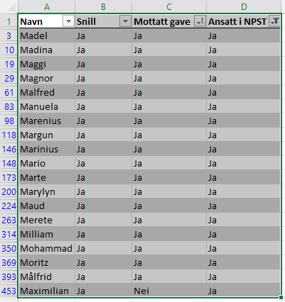

Her finner vi fort ut at Maximilian er den som skiller seg ut og vi kjører på med `PST{Maximilian}` som er løsningen på denne oppgaven og vi har nå avslørt identiteten til -M

## Luke 23

Lost_key.txt: `493`
Fra luke23: `i13 B11 K10`

## Luke 24

Før luke24 ble sluppet så kom det en oppdatering i dass.p26e.dev som gjorde at det kom en ny funksjon for "Julenisse-passordgjenoppretting" der man så hint til hva som gjemte seg bak modulen. Når oppgaven ble sluppet klokken 09:00 så kunne man allerede da ha svarene klare.

```
Selv om vi har funnet den ansvarlige må vi fortsatt fikse opp i ruta som er blitt tukla med, men Julenissen har glemt passordet til slede-GPSen.

Før du kan ta fri må du fikse en siste liten oppgave for Julenissen! Det er å finne ut av passordet til Julenissen med Julenisse-passordgjenopprettings-verktøyet, mens han gjør ferdig de siste forberedelsene til jul! Kanskje det ligger noe info på kontoret hans du kan bruke, eller har du hørt noe nyttig informasjon tidligere?

Det er viktig at du løser dette så fort som mulig slik at vi får reddet julen før det er for sent. Lykke til!

Rapporter tilbake med julenissens passord omkranset av PST{ og }, og bruk gjenopprettingsnøkkel hohoho_god_jul.

Mvh Mellomleder
```

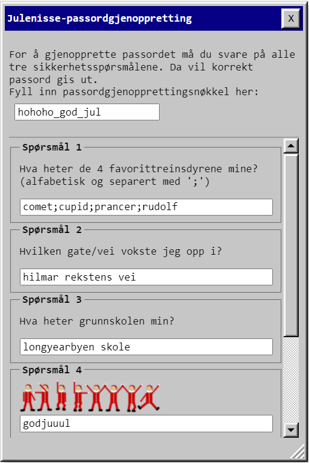

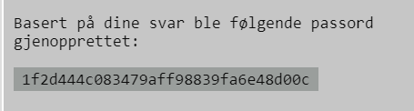

Vi fant de 4 favorittreinsdyrene til Julenissen i luke14. Nå var det bare for oss å sette de i alfabetisk rekkefølge - `Comet;Cupid;Prancer;Rudolf`

Hvor julenissen vokste opp da det ble spurt om gate/vei, var også veldig enkelt, da vi hadde fått et gatenavn i et bilde på luke23 - `Hilmar Rekstens vei`

Hva grunnskolen til Julenissen var ble noe vanskeligere da det var ingen referanser til en skole tidligere i julekalenderen. Her måtte man bare gjette seg til at det var `Longyearbyen Skole` de var ute etter, noe som er naturlig da det er den eneste skolen på Svalbard.

Det siste spørsmålet var lett å kjenne igjen som et Flag Semapahore-cipher ikledd nissedrakt. Manuell oversettelse fra bildet med en typisk nettside som https://www.dcode.fr/semaphore-flag gir svaret `godjuuul`

```
Comet;Cupid;Prancer;Rudolf
hilmar rekstens vei
longyearbyen skole
godjuuul
```

Vi har nå svar på alle kontrollspørsmålene, som gjør at vi får generert en hash som vi setter inn i flagg-formen og vi kan levere riktig svar.

`PST{1f2d444c083479aff98839fa6e48d00c}`

## Egg #1 (under Luke 10)

Under Luke 10 så ble man igjen lenket til NPSTs varelager. Sammen med alle andre som ble lastet til denne siden, så lastet man nå også en misstenkelig bildefil som ikke har vært der før.


Første egg blir da `PST{EGG_StRpiITbqyEsBJM}`

## Egg #2 (under Luke 12)

Luke 12 ga oss løsningsteksten `skalgibeskjedfrapengwynomatsolenskinnerimorgen` og `pstkroellparentesberlinerkranserkroellparentes`

En tidlig tanke var at nøkkelen for krypteringa var egget her. De fleste andre i konkuransen som hadde klart Luke 12 hadde også levert egget så det var sannsynlig at nøkkelen også var egget.

Matte'n for denne krypteringa funger slik:

`key ⊕ plaintext = ciphertext`

Men også:

`plaintext ⊕ ciphertext = key`

Ettersom vi vet både plaintext og ciphertext her så har vi mulighet til å generere keys. Vi trenger først bare å konvertere binærcipher-data til hex og plaintexten til hex og dra det inn i cybershef:

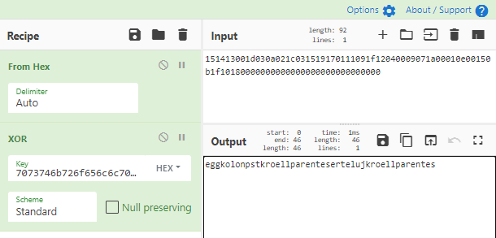

Vi ender da opp med `eggkolonpstkroellparentesertelujkroellparentes` som oversettes til flagg `PST{erteluj}`

## Egg #3 (under Luke 14)

I bildet `Rudolf.png` fra Luke 14 kan man finne egget i Red-layer #2

`PST{Egg_RudolfErRoedPaaNesen}`

## Egg #4 (under Luke 23)

I bildet `julekort.png` så finner man en del interesante ting. Her er klartekst fra ulike bitlag:

r0 = `tikk... takk... tikk... takk...`
r1 = `hvor peker klokka mon tro.`
g1 = `ikke tall men antall streker langs klokka...`
b0 = `lang kort lang kort`


antall streker totalt: 12 \* 5 = 60 = 1 min = 1 strek

Ser man på langviseren så står den på strek #5 fra toppen av, lille viseren på strek #15 fra toppen av osv, osv.
Vi finner derfor disse tallkombinasjonene:

5 15 6 20 - 515620

Flagget blir da: `PST{Egg_515620}`
