# PST Påskenøtter 2023

[Artikkel om at julen er avlyst](./uploads/upload_a4763c6011761c00935b551f4b1ad077.png)

Grensesnitt for konkurransen: https://dass.p26e.dev/


Alle flagg:

| Oppgave         | Flagg                                       |
| --------------- | ------------------------------------------- |
| PreNøtt         | ```PST{Eggselsior!}```                      |
| Kongelig Brøler | ```PST{NOEN_UVANLIGE_STILLINGER}```         |
| Ook?            | ```PST{A1m05tL1k3Bra1nfuck}```              |
| Vårrengjøring   | ```PST{Med_øyne_i_kryss}```                 |
| Hvit boks       | ```PST{MANNEN_SOM_LEKTE_MED_MINNET}```      |
| Sort på hvitt   | ```PST{h1dd3n_1n_pl41n_s1ght}```            |
| Tallknusing     | ```PST{HARE}```                             |
| Kryss og Tvers  | ```PST{Rail_Fence_er_en_fin_liten_twist}``` |
| Dataforskning   | ```PST{EGGESKALL}```                        |
| Interdepartemental samhandling gir merverdi                |   ```PST{Powershellig_grunn_til_mistanke}```                                          |

                                     


EGG 🥚

| Tilknytning     | Flagg                          |
| --------------- | ------------------------------ |
| SjakkEgg        | ```EGG{Kule_sjakkvarianter}``` |
| StreogramEgg    | ```EGG{EGGSOR}```              |
| KlukkeEgg       | ```EGG{0_CLUCKS_GIVEN}```      |
| InformasjonsEgg | ```EGG{the_plot_chickens}```   |


## 01.04 - Kongelig Brøler

```
Hei [Navn],

godt å se at du finner deg til rette. Her er det første du må løse for oss. Du vil få flere oppdrag til og med søndag 9.4.

Pen GWYN gjorde en skikkelig brøler og ble tatt i forbifarten ved sikkerhetskontrollen på flyplassen. Under armen hadde han et sammenleggbart sjakkbrett med et dokument inni. Dokumentet ser ut til å være kryptert.

Undersøk filen og rapporter funn.

Mellomleder

📎 FEN.txt
```


[Filen, FEN.txt](https://pastebin.pl/view/c828be7c), inneholder det som ser ut som FEN-notation som er en form for å definere en sjakk-stilling. Dette kan dekodes i en enkel online-dekoder eks https://www.dcode.fr/fen-chess-notation

Man kan gjøre dette manuelt men det er ganske kjedlig og tidkrevende. Her kan man lage et program som henter opp alle stillingene og printer hver stillign ut til fil:

```python=
from selenium import webdriver
from time import sleep
import urllib.parse
from PIL import Image
driver = webdriver.Firefox()
with open("FEN.txt") as f:
    for index,line in enumerate(f):
        line = line.replace('FEN "', '').replace('",\n', '')
        url = f'https://humanchimp.neocities.org/starting-position.html?{urllib.parse.quote(line)}'
        print(line, url)
        driver.get(url)
        sleep(0.1)
        filename = f"screenshot_{index}.png"
        driver.get_screenshot_as_file(filename)
        image = Image.open(filename)
        box = (15, 15, 920, 920)
        new_image = image.crop(box)
        new_image.save(filename)
driver.quit()
```

Man kan så dytte alle filene i en [online image-merger](https://products.aspose.app/imaging/image-merge) som setter sammen alle til ett:

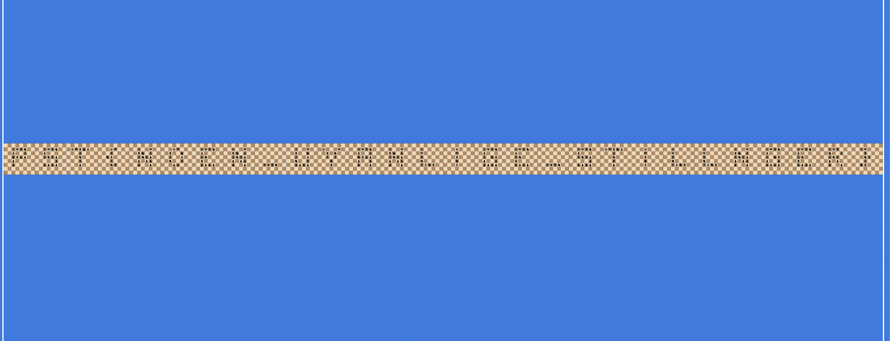

Dette gir flagget ```PST{NOEN_UVANLIGE_STILLINGER}```


## 02.04 - Ook?
```
En orangutan mistenkt for samarbeid med sydpolare aktører har blitt arrestert. Han forsøkte å spise noen dokumenter før vi fikk tatt beslag i dem, men vi klarte å redde dette. Dessverre skjønner vi ikke et pip.

Se om du finner ut av noe. Ook?

Mellomleder

📎 Ook.txt
```

Ook.txt er en stor tekst fil som ser slik ut men mye lengre:

```Ook. Ook. Ook. Ook. Ook. Ook. Ook. Ook. Ook. Ook. Oo....```

Dette ser ut som JS-fuck og etter et googlesøk så er dette ganske tett knytta til esotroiske kodespråk. I dette tilfellet heter språket [Ook!](https://esolangs.org/wiki/Ook!) 

Vi kan finne en enkel [dekoder](https://www.splitbrain.org/_static/ook/) på nettet som gjør koden om til tekst.

Vi får ut flagget ```PST{A1m05tL1k3Bra1nfuck}```


## 03.04 - Vårrengjøring

```
Mellomleder ba meg se på dette bildet i går, men nå har jeg stirra på det til jeg blir skjeløyd og finner ingenting! Kan du ta over saken?

Tastefinger

PS: Om du trenger en rubber duck for å debugge noe kan du låne stegosauren som står på plassen min.

📎 bilde.png
```

Bildet er ved første øyekast et helt vanlig bilde.
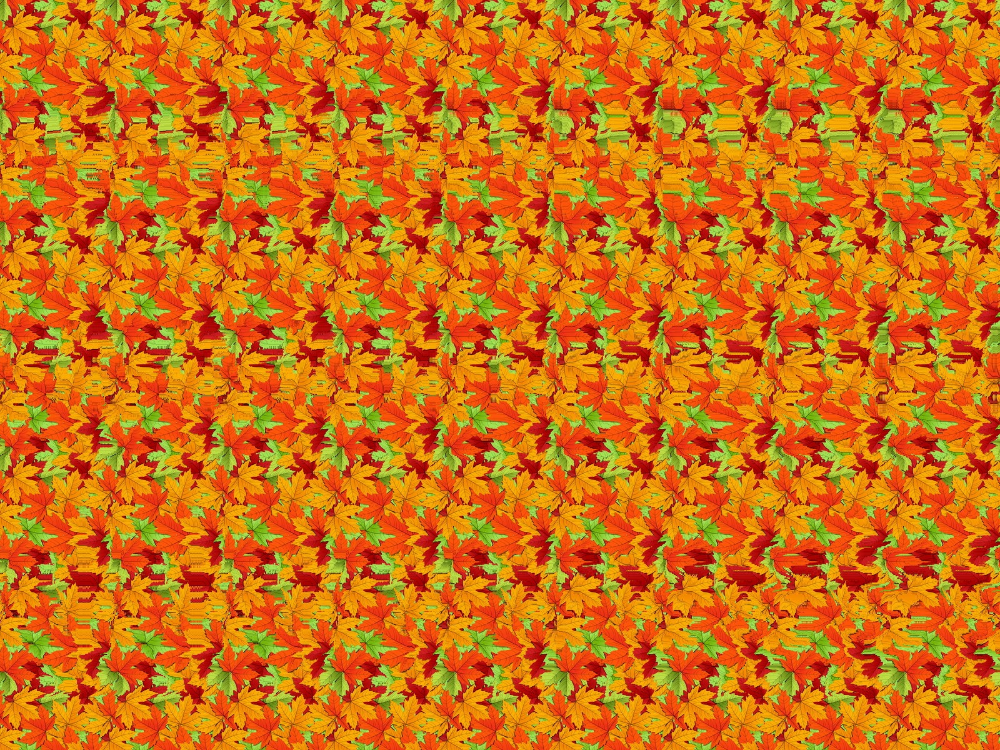

Når man ser på bit-nivåene med stegsolve så ser man at disse kommer til syne:

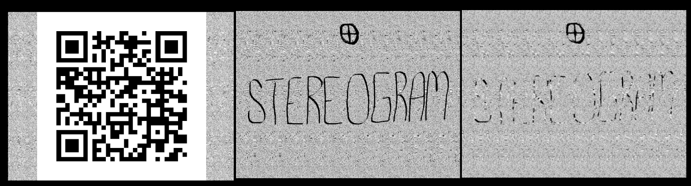

QR-koden er en RickRoll.

Neste bilde ser ut til å være ⊕ STEREOGRAM. Dette må altså være et stereogram. Vi søker på google for stereogram-solver og finner denne siten: https://piellardj.github.io/stereogram-solver/

Laster opp originalbildet og voila:


Flagget er ```PST{Med_øyne_i_kryss}```

## 04.04 - Hvit boks


```
NPST har hentet frem et beslag de tror kan ha en sammenheng med hendelsen sist jul. Beslaget ble tatt av en hvit boks med "lappes dualistisk" tusjet på. NPST har sett på dette fra alle kanter, men ikke funnet ut av noe.

Her må det nok en kylling til!

Mellomleder

📎 hvitboks
```

```hvitboks``` er en ELF-fil som er på hele 36mb. Den har ingen main-funksjon så det gjør at den er vanskelig å reversere og inneholder ekstremt mange funksjoner og hopp. Når man kjører filen så får man spørsmål om et passord. Om man taster feil passord, så printer programmet dette og avslutter.

Å kjøre ```strings``` mot fila viser at det er en posisjon som sier at man har gjettet riktig passord og at man får flagget. Men i dekompilert psudokode så finner man ikke umiddelbare svar på hva passordet kan være. 

Det var når man startet å kjøre debugging i [IDA](https://hex-rays.com/ida-free/) at man så hva programmet gjorde. Man kunne finne der hvor man skrev ut "Feil passord" og se hva som forårsaket dette.

Programmet gjør en sjekk på om RDX og RAX er like. Her kan man sette et breakpoint og endre verdien i RAX til å være lik RDX.

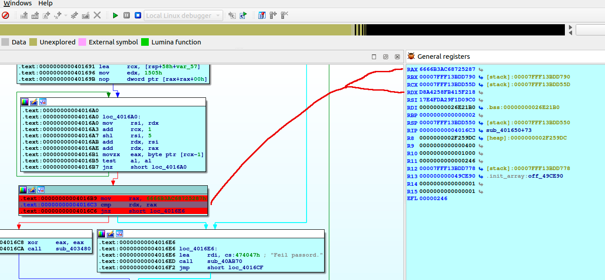

RAX og RDX er nå like og programmet går ikke i funksjonen som gir oss "Feil passord" men går videre til å kjøre ut flagget:

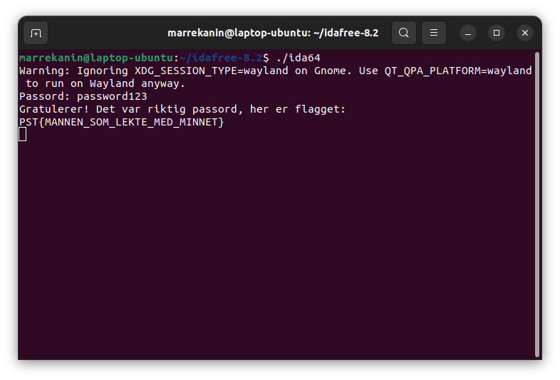

Flagget blir da ```PST{MANNEN_SOM_LEKTE_MED_MINNET}```


## 05.04 - Sort på hvitt

```
Det har blitt avdekket et nettverk av sydpolare illegalister som kommuniserer mellom hverandre i det åpne, men ingenting av det de sier gir noe mening. Vi mistenker at dette har sammenheng med brannen i Jule NISSEN sitt verksted.

Mellomleder

📎 rapportering.txt
```

Teksten i ```rapportering.txt```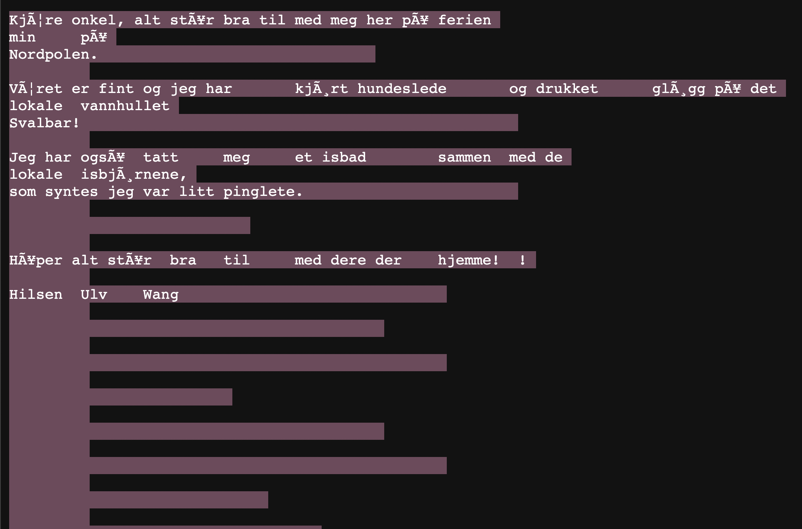

Her har man erfaringen med seg og ser veldig fort at dette mest sannsynlig er et whitespace cipher. Det enkleste å gjøre her å google til en online whitspace cipher dekoder som f.eks denne: https://www.dcode.fr/whitespace-language

Legge teksten inn og kjøre dekryptering.

Flagget blir dat ```PST{h1dd3n_1n_pl41n_s1ght}```


## 06.04 Tallknusing

```
Så mange tall har ikke jeg sett siden jeg var i niende eller tiende klasse! Jeg tror jeg heller holder meg til Sudoku.

Men! Noen må fortsatt finne ut av dette. Kan du?

Mellomleder


101 148  35 103  80 146 102  72  76
 80 103 102 148  76  72 101  88 146
 76  72 146 101  88  35 148  35  80
148  88  76  72 101 103  80 146 102
 35  80  72 102 148  88 103  76 101
103 102 101  76 146  35  35 148  88
 88 146 148  80 103 101  76 102  72
 72  35 103 146 102  35  88  80  35
102  76  80  88  72 148 146 101 103

PS: Jeg er i en annen base til i morgen. Om du trenger noe så ta kontakt med Tastefinger.
```

Denne var ikke lett. Jeg fikk et godt tips fra discord og konvertere tallene til base9 som gjorde at jeg fort kunne finne noe som var gjenkjennbart.

Skrev derfor dette python scriptet:

```python=
data1 = [101, 148,  35, 103,  80, 146, 102,  72,  76]
data2 = [80,  103, 102, 148,  76,  72, 101,  88, 146]
data3 = [76,   72, 146, 101,  88,  35, 148,  35,  80]
data4 = [148,  88,  76,  72, 101, 103,  80, 146, 102]
data5 = [35,   80,  72, 102, 148,  88, 103,  76, 101]
data6 = [103, 102, 101,  76, 146,  35,  35, 148,  88]
data7 = [88,  146, 148,  80, 103, 101,  76, 102,  72]
data8 = [72,   35, 103, 146, 102,  35,  88,  80,  35]
data9 = [102,  76,  80,  88,  72, 148, 146, 101, 103]


data = [data1, data2, data3, data4, data5, data6, data7, data8, data9]

for g,x in enumerate(data):
    if g % 3 == 0:
        print("-------|--------|-------|")
    for i,y in enumerate(x):
        if i % 3 == 0 and i != 0:
            print(" |", end=' ')  
        print(chr(int(str(y), 9)), end=' ')
    print("|", end='')
    print("")
```


| output | redigert | 
| -------- | -------- | 
|   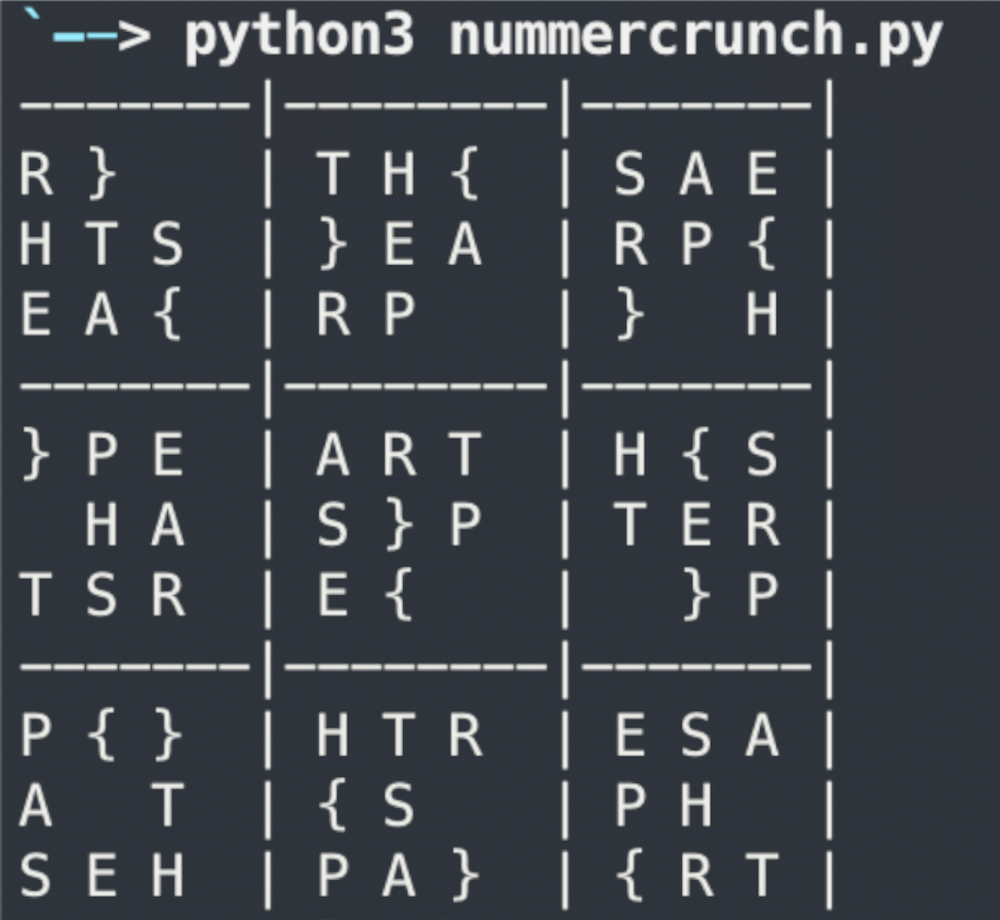   | 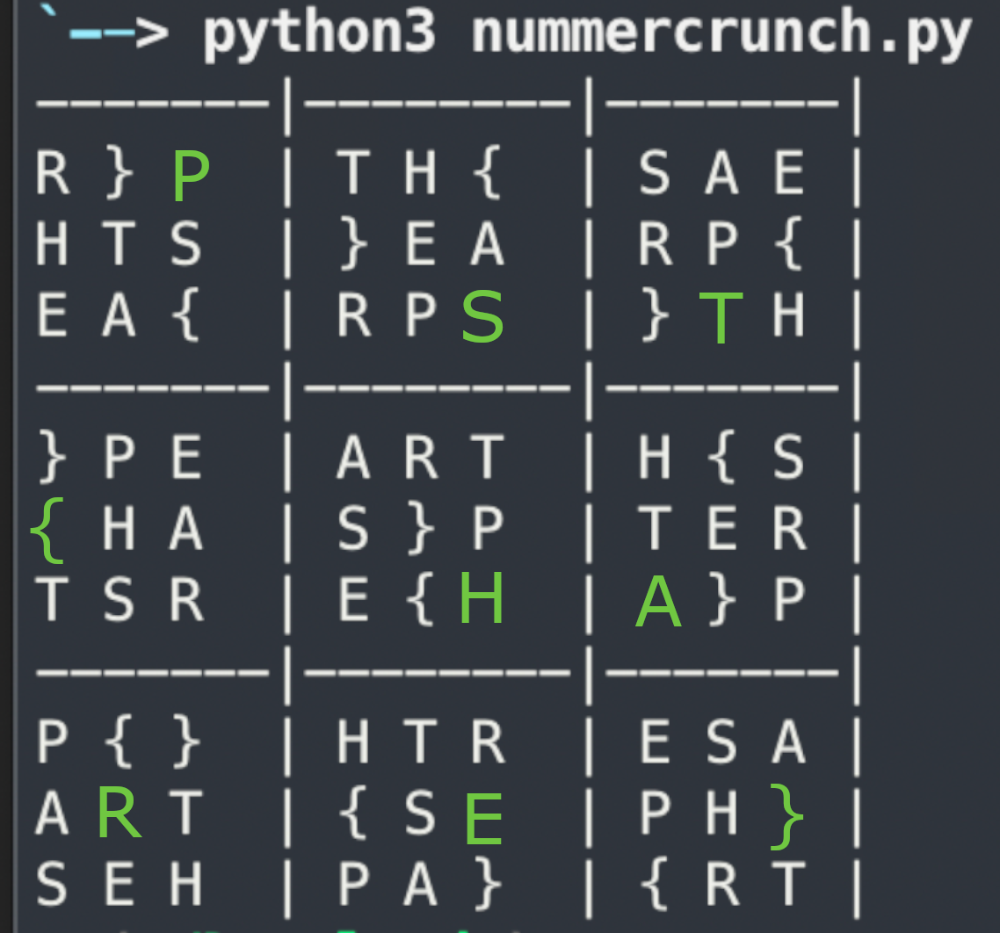     | 

## 07.04 Kryss og tvers
I denne oppgave får vi presentert to filer `encoder.py` og `flagg.bin`.
Førstnevnte er et python-script som ser ut til å encode input og lagre innholde i en fil. Sistnevnte er da sannsynligvis flagget, bare kjørt gjennom encoder-skriptet. 

Oppgaven blir da å "reverse engineere" encoding-skriptet. Innholdet i denne filen er som følger:
```python=
import math
import base64


def forward_engineering(flagg):
    p1 = int("000".join([str(ord(c)) for c in flagg[:math.ceil(len(flagg)/3)]])) ^\
        int("000".join([str(ord(c)) for c in flagg[math.ceil(len(flagg)*2/3):]]))

    p2 = int("000".join([str(ord(c)) for c in flagg[math.ceil(len(flagg)/3):math.ceil(len(flagg)*2/3)]])) ^\
        int("000".join([str(ord(c) << 2) for c in flagg[math.ceil(len(flagg)*2/3):]]))

    p3 = p1 ^ int("000".join([str(ord(c)) for c in flagg[math.ceil(len(flagg)*2/3):]]))

    jx = base64.b64encode("123456789".join([str(p1), str(p2), str(p3)]).encode("ascii"))

    with open("encoded.bin", "wb") as file:
        file.write(jx)

```

Første man må gjøre er å lese ut filinnholdet i `flagg.bin` og kjøre en base64 dekodering, for så å splitte opp på `123456789`, slik at vi står igjen med et array med `p1`, `p2` og `p3`.

Ettersom "inverse" av en xor operasjon kan finnes på følgende måte:
`a = b ^ c` => `c = a ^ b`, så kan vi finne andre operant av p3 ganske greit:
`xor_operant = p3 ^ p1`, som er samme operant til å utlede p1 selv. Slik kan vi da finne første operand for p1 også:
`første_operand = xor_operand ^ p1`

Jeg _tror_ løsningen ser ut i retning av:
```python=
from encoder import forward_engineering
import base64

def reverse_ordinal(value):
    value_as_string = str(value)
    value_as_array = value_as_string.split('000')
    
    for index, entry in enumerate(value_as_array):
        if entry[0] == '0':
            value_as_array[index - 1] += '0'
            value_as_array[index] = value_as_array[index][1:]

    return ''.join([chr(int(x)) for x in value_as_array])

def reverse_engineering(flagg):
    three_p = str(base64.b64decode(flagg).decode("ascii")).split("123456789")
    p1 = int(three_p[0])
    p2 = int(three_p[1])
    p3 = int(three_p[2])
   
    p3_solve = p3 ^ p1
    p1_solve = p3_solve ^ p1
    
    p3_text = reverse_ordinal(p3_solve)
    p2_solve = p2 ^ int("000".join([str(ord(c) << 2) for c in p3_text]))

    print(reverse_ordinal(p1_solve))
    print(reverse_ordinal(p2_solve))
    print(p3_text)


with open("flagg.bin", "rb") as file:
    reverse_engineering(file.read())
```
Denne gir da output:
```
ZigZag PR_cr__ew}S{alFnee_nfnltntitTie_eii_s
```
Søker man litt på ZigZag encoding så finner man at det er noe som heter "Railfence encoding".
Først prøvde jeg å putte hele løsningsstrengen inn i en dekoder (eksempelvis den fra CodeChef), uten hell.

Så prøvde jeg alt _etter_ "ZigZag" og da dukket svaret for opp:

`PST{Rail_Fence_er_en_fin_liten_twist}`


## 08.04 Dataforsking
Denne gangen fikk vi utlevert en csv-fil, med masse data på formen:
```
vingespenn,gjennomsnittlig antall egg samlet per dag,kyllingtype
1,0,'0'
2,0,'0'
3,0,'0'
4,0,'0'
5,0,'0'
6,0,'0'
```

Ett hint i oppgaveteksen gir oss retningen vi skal ta: "Akkurat hva som skal gjøres med dataen er vi litt usikre på, men noen mener at den kanskje bør visualiseres.", slik at jeg gikk rett for å søke på "csv visualize online" på DuckDuckGo.

Etter litt prøving og feiling på forskjellige sider, så kom jeg over [CsvPlot](https://www.csvplot.com/), som så ut til å ha det som trengs.
Lastet opp bildet der og eksperimenterte litt og fant fort ut at "noe" var der i visualiseringen:
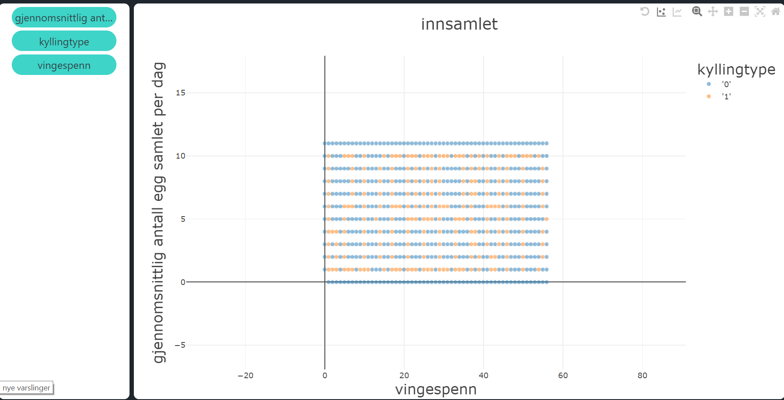
Tok screenshort av dette og etterpå speilvendte jeg bildet og fikk da:
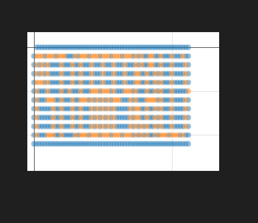

Det er ikke helt lett å se hva som står, men med litt skråblikk så kan man se at det står følgende løsningsord:

`PST{EGGESKALL}`


Etterpå kunne man også lage et pythonscript som printer flagget i klarere tekst:

```python
import csv
with open('innsamlet.csv') as f:
    reader = csv.reader(f)
    next(reader)
    rows = list(reader)
for i,x in enumerate(rows):
    try:
        nextrow = int(rows[i+1][0])
    except:
        nextrow = 0
    if x[2] == "'0'":
        print("  ", end='')
    if x[2] == "'1'":
        print("██", end='')
    if int(x[0]) >= nextrow:
        print("")
```


## 09.04 Interdepartemental samhandling gir merverdi
```
Teknikere fra direktoratet for høytidsteknologi har bistått Jule NISSEN med å hente ut informasjon fra skadede systemer på verkstedet som kan være relevant for etterforskningen. Dessverre har de sendt det over på en sikker måte, så det er litt usikkerhet rundt hvordan vi skulle få sett på det.

Her trenger vi en skarp Kyllingagent til å se på det!

Mellomleder
```

I denne oppgaven fikk vi utdelt en del filer:
* Vedlegg_1.txt
* Foelgeskriv.txt
* Do-Chickencrypt.ps1
* Invoke-Svadacrypt.ps1
* InformasjonsBasseng.7z

Ikke uventet var zip-filen kryptert og regnet med at passordet ville ligge i noen av de andre.

#### Vedlegg_1.txt
Vi åpnet ```Vedlegg_1.txt``` og ble møtt med noe som så ut som ascii forkledd som desimaltall:
```
31
54
54
53
62
36
....
```
Ved å bruke Magic-formelen i [CyberShef](https://gchq.github.io/CyberChef/) fikk man fort greie på at tallene måtte dekodes fra desimal og XOR'es med Hex-verdien 50.

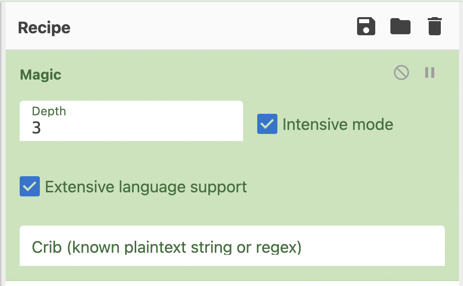

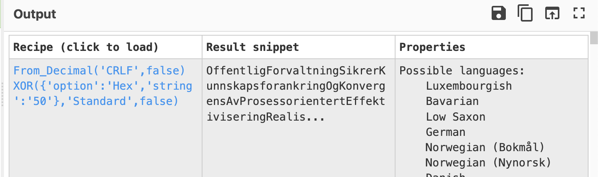


Resultatet ble altså:
```OffentligForvaltningSikrerKunnskapsforankringOgKonvergensAvProsessorientertEffektiviseringRealiseres```


#### Invoke-Svadacrypt.ps1

Dette så ut til å være et script som hadde et bilde som viste: 


Her måtte vi nok inn med en nøkkel for å få ut et passord.

Det hele virket veldig merkelig da det ser ut som om man må ha passordet man skal prøve i clippboardet:

```$data = [System.Windows.Forms.Clipboard]::GetText()```

Her kunne man erstatte med passordet vi allerede kjennte til:

```$data = "OffentligForvaltningSikrerKunnskapsforankringOgKonvergensAvProsessorientertEffektiviseringRealiseres"```

Med dette og med litt tweaking i koden så får man denne outputen:

```En nøkkel myst! Prøver å bruke den til å avtåke riktig passord
Tåken letter! Nøkkelen dine vakre glugger myser er: 
FagseminarOmVedtakAvStrategiskImplementringsplanForTverrfagligHorisontalSamhandlingVilAnbringeIterativSynergi
```

Så nå fikk vi et nytt passord som vi må bruke videre i oppgaven.

#### InformasjonsBasseng.7z/InformasjonsBasseng.db

Med passordet fra den forrige filen kan vi pakke ut ```InfromasjonsBassend.7z``` som var passordbeskyttet. Passordet var altså: ```FagseminarOmVedtakAvStrategiskImplementringsplanForTverrfagligHorisontalSamhandlingVilAnbringeIterativSynergi```

Vi får ut fila ```InformasjonsBasseng.db``` som er en sqlite3-fil som inneholder disse tabellene:

```
AI_Assistent
SantaHome
data
informasjon
testprod
```

Her er det data-tabellen som er interessant.

De 5 første radene i data-tabellen ser slik ut:

```
0|PEFRMTDJK9WS184KG1NH8CT8AP3HERH306848QURPJNV7PX2FXYBZG4NB8OAE8DV
1|ISDGQRA8KALM1OTUCS5272ECAH427F1E25FSSQF7F5LCSE0RLDPWGDQTZYD44G30
2|I2T6LBJJBA6FIN6M9WA0B353OR720DGMWHZPW2SVDQ9T1QZDF7B2DW1OZ38DRJBE
3|WKE{PBVCBWDD29FR5KK90VC9J3NCZ2CMBGGFNOVV82UW1LDIJWUJI7K4Q0EDMX4M
4|I5HFP87V73ZRA7R3E37BTU7UKJ1DZ0TMAT1NZ0JTVRJHXMBJUIPHN37WWBWNWOCM
5|FLFW3o39BGQ69TL33EZ2HZRHRILIJQBSJ44KXXQ1CO2K7THY0VJWL9IB2DZPCP45
```

Her ser man konturene av et flagg, da første bokstav i første setning er ```P```. Andre bokstav i andre setning er ```S``` osv...

Vi lagrer dataene til ```data.txt```

Vi skriver en enkel pythonkode så vi slipper å må gjøre ting manuelt:

```python=
i = 0
flagg = ""
with open("data.txt") as f:
    for line in f:
        flagg += (line[i])
        i += 1 
print(flagg)
```

Flagget kommer da til syne og er: ```PST{Powershellig_grunn_til_mistanke}```


## SjakkEgg 🥚

De tre siste linjene fra ```01.04 - Kongelig Brøler``` er fortsatt ukjent hva betyr. De inneholder fullsatt sjakkbrett som ikke umiddelbart gir mening for oss.


| 1 | 2 | 3 |
| -------- | -------- | -------- |
| 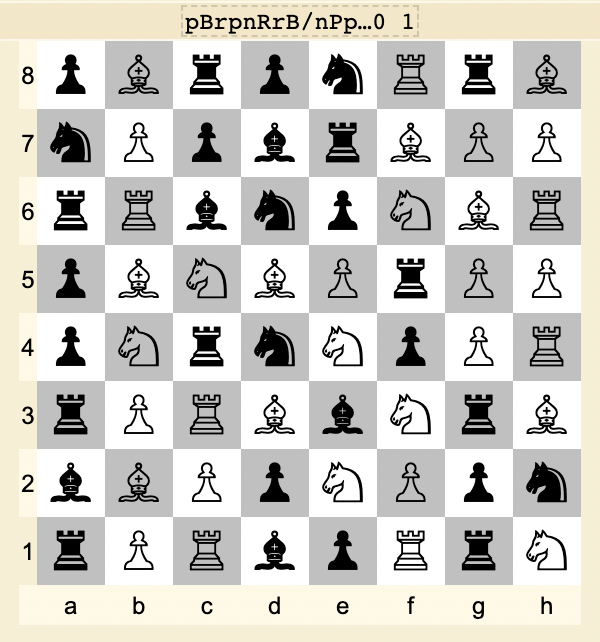     | 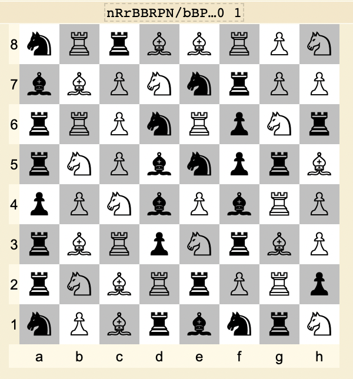     | 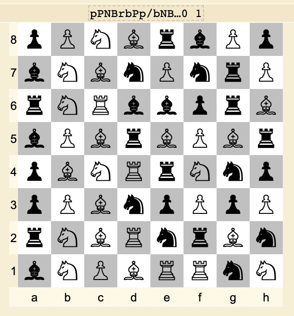     |


Ved enkel visuell analyse så ser vi at første rekke har kun sorte brikker ♜ og andre rekke kun hvite brikker ♖. Når ting er så sort-hvitt som dette så tyder det fort til at vi har med binære tall å gjøre. 

Første rekke i første bildet vil kunne konverteres slik:
♜♖♜♜♜♖♜♖ = ```E```
```01000101``` = ```E```


Vi skriver et script som konverterer alt til tekst:


```python=
data1 = 'FEN "pBrpnRrB/nPpbrBPP/rRbnpNBR/pBNBPrPP/pNrnNpPR/rPRBbNrB/bBPpNPpn/rPRbpRrN w - - 0 1"'.replace('FEN "', '').replace(' w - - 0 1"', '')
data2 = 'FEN "nRrBBRPN/bBPNnrPP/rRPnRpNr/rNPbnprB/pPNbPbRP/rBRpNrBP/rNBRrPRp/nPBrbnrN w - - 0 1"'.replace('FEN "', '').replace(' w - - 0 1"', '')
data3 = 'FEN "pPNBrbPp/bNBnPnrP/rNRbbprB/bPBrBPBr/pBNRrNnp/pPBnpPpP/rNBRnrBn/bNPBRRnN w - - 0 1"'.replace('FEN "', '').replace(' w - - 0 1"', '')
data = (data1 + data2 + data3).split("/")
binarystring = ''
for y in data:
    for x in y:
        if x.isupper():
            binarystring+='1'
        else:
            binarystring+='0'
print(''.join(chr(int(binarystring[i*8:i*8+8],2)) for i in range(len(binarystring)//8)))
```
Da kommer egget: ```EGG{Kule_sjakkvarianter}```

## StereogramEgg 🥚

Etter mye frem og tilbake og kombinere versjoner av bildet i stegsolve kom man plutserlig over at xor'e den grønne og blå bitplanen mot hverandre:

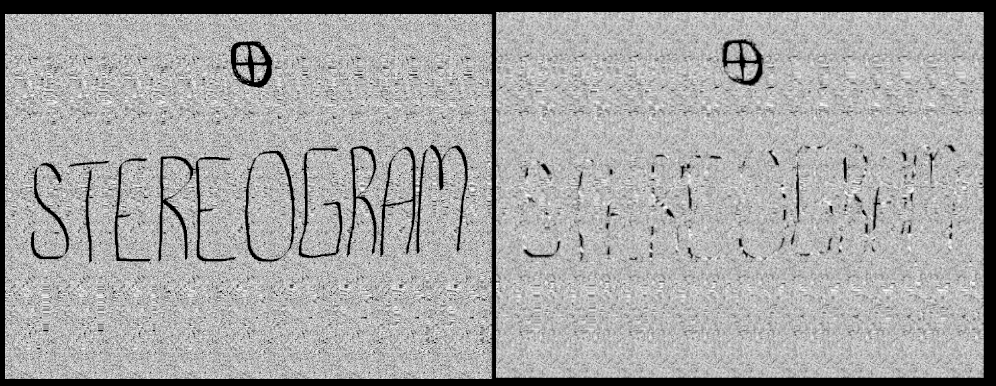

Dette ga gode resultater og egget kom til syne:


```EGG{EGGSOR}```

## KlukkeEgg 🥚

I filen ```Do-Chickencrypt.ps1``` 09.04 så var det et script som kjørte data til krypterte klukk i terminalen. En av variablene i scriptet var en banner som så slik ut:

```$Banner_2 = """. --. --.{----- ..--.- -.-. .-.. ..- -.-. -.- ... ..--.- --. .. ...- . -.}"""```

Dette så misstenkelig ut som morsekode. Så når vi dekoder dette i en [online-dekoder](https://www.dcode.fr/morse-code) så får vi følgende Egg ut:

```EGG{0_CLUCKS_GIVEN}```

## InformasjonsEgg 🥚

Det var også en annen tabell i 09.04 som så interessant ut. Dette var en tabell som het ```informasjon```. Denne hadde samme struktur som ```data```, men var ikke noe opplagt flagg å hente ut på samme format.


Ved en rask analyse så man at linjene i bunnnen av tabellen var gjennkjennbare, da den første bokstaven i siste linje startet med ```E``` og den andre bokstaven i nest siste linje var en ```G``` beynte det å lukte Egg.
```
16|34EK1hI5P9O0U6JUU6HQI6Q1C87WVYG77ZM1MJYPK7K7CSQ4YDIUXD55FE0U616K
17|BU2VtRIRSC4U05G5040FYY4O9K9DIIYSI52L2PVARFD1PMSPXYI7W42UODVJR5TL
18|Y1V{PPES44LLKZMRYDU0YSOYCEIFGZ0TVDEZU5ASK03LM6XP440I6BMPQZ0TI9QF
19|RMGZOCNZJY2N8A7CB356J1V47EHII4HIYYP3PNOB1B10USHRSQIA77BIPKDZ5VOA
20|5GQ6I2T9ZGLMNZMY6LGNGZU1PDQHL2LX28EKU233AOHWXHP2KETZ0ERH2I3QYO1J
21|EOK6YAVSR5G4O5FCWK3FMA5457MEQQUVZFPFFLV6Y9PL6RYTL4MZ70WFNGR8GYZ6
```

Man redigerer bare litt på koden man hadde for flagget i 09.04 og kjører denne koden:

```
data2 = []
with open("egg.txt") as f:
    for line in f:
        data2.append(line)
data2.reverse()
i = 0
flagg = ""
for x in data2:
    flagg += (x[i])
    i += 1
print(flagg)
```

Ut kommer egget: ```EGG{the_plot_chickens}```
